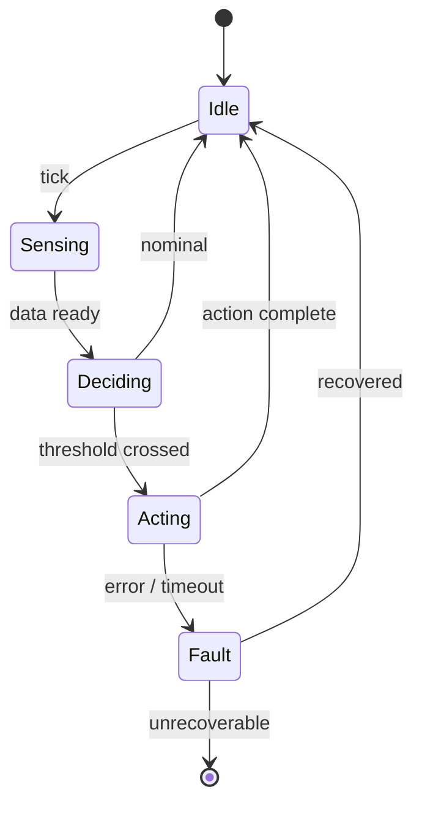

<!--
  ╔══════════════════════════════════════════════════════════════╗
  ║  This is a GitHub *profile* README.                          ║
  ║  Put it in a repo named EXACTLY the same as your username,   ║
  ║  e.g.  github.com/landon/landon  →  /README.md               ║
  ║  Replace every  your-username  below with your real handle.  ║
  ╚══════════════════════════════════════════════════════════════╝
-->

<div align="center">

# Hi, I'm Landon 👋

### Computer Engineering + Computer Science @ UW Tacoma

*Building systems end-to-end — from the silicon up to the application layer.*

<!-- Badge row — these render as little pills on GitHub -->


[](https://github.com/your-username)

</div>

---

## 📌 Table of Contents

1. [About Me](#-about-me)
2. [Tech Stack](#-tech-stack)
3. [How I Think About Systems](#-how-i-think-about-systems)
4. [Featured Projects](#-featured-projects)
5. [Currently](#-currently)
6. [Stats](#-stats)
7. [Reach Me](#-reach-me)

---

## 🧑‍💻 About Me

> [!NOTE]
> I'm a double major in **Computer Engineering** and **Computer Science** at the
> University of Washington–Tacoma, drifting happily toward the place where
> *firmware meets silicon*.

Here's me as a struct I'd actually be comfortable shipping:

```lua
-- the only language where 1-based indexing feels right
local Landon = {
    school       = "UW Tacoma",
    majors       = { "Computer Engineering", "Computer Science" },
    focus        = "embedded systems & hardware/software integration",
    languages    = { "C", "C++", "C#", "Python", "Java", "Lua", "Verilog", "MATLAB" },
    favoritePattern = "finite state machines",  -- they show up in *everything* I build
    currentlyLearning = { "Markdown", "PCB layout", "the dark arts of ESP32 timing" },
}

function Landon:greet()
    return ("Hello! I build things from the %s up to the %s.")
        :format("transistor", "UI")
end

print(Landon:greet())
```

A few things that are true about how I work:

- I like designing across the **whole stack** — schematic → breadboard → PCB → firmware → app.
- I've done several years of **commissioned / freelance** dev work, so I'm comfortable turning fuzzy client requirements into shipped systems.
- I document obsessively (yes, even in LaTeX). Future-me and my teammates deserve it.

---

## 🛠 Tech Stack

| Domain | Tools & Languages |
|:-------|:------------------|
| **Embedded / Firmware** |   ESP32 · ATmega328P · Arduino · Raspberry Pi |
| **Hardware** | KiCad · LTSpice · I²C / RS-485 · sensors & actuators · LiPo + buck regulation |
| **Software** |    |
| **Game Dev** |  Roblox Studio · Argon · Rojo-style sync |
| **HDL / Math** | Verilog · MATLAB |
| **Tooling** |    LaTeX |

---

## 🧠 How I Think About Systems

I keep ending up at the same architecture — clean state, explicit transitions, a fault
path that actually recovers. Here's the FSM shape that shows up in almost everything I make,
rendered as a [Mermaid](https://mermaid.js.org/) diagram (GitHub renders these natively):



> [!TIP]
> Whether it's a plant-watering controller, an RFID entrance gate, or a Roblox combat move,
> the bones are the same: **read → decide → act → recover**.

---

## 🚀 Featured Projects

<details open>
<summary><b>🌱 Herbinator</b> — distributed IoT plant-watering system</summary>

<br>

A smart, networked plant-care system built with a **team of 5**.

- Distributed **FSM-based watering units** talking to a central **ESP32**
- Capacitive soil-moisture + **BME280** sensors compute **vapor pressure deficit (VPD)** to make watering decisions
- Hardware iterated from **pinout schematics → breadboard → custom PCB**
- Companion **mobile app** for plant profiles and live monitoring

```
[Sensor Node] --I2C--> [ESP32 Hub] --WiFi--> [Mobile App]
     │                      │
  moisture/VPD          FSM logic
```

`#embedded` `#esp32` `#sensors` `#pcb-design`

</details>

<details>
<summary><b>⚔️ GearsBB</b> — Roblox battlegrounds-style combat game</summary>

<br>

A combat game built in **Luau** with a small dev team (including a dedicated VFX designer).

- Attack moves built on a reusable **finite-state-machine framework** (`init → active → end → terminate`)
- **GitHub version control** with **Argon** two-way syncing into Roblox Studio
- Per-place project configs so teammates sync *only* what they need

`#roblox` `#luau` `#fsm` `#gamedev`

</details>

<details>
<summary><b>🚧 Entrance Gate Controller</b> — Arduino RFID access system</summary>

<br>

An access-control gate driven by a clean state machine.

- **RFID UID** validation against an allow-list
- LED status (red / yellow / green) + cheerful multi-tone buzzer feedback
- Non-blocking `millis()`-based timing throughout

`#arduino` `#rfid` `#fsm`

</details>

---

## ⏳ Currently

- [x] Shipped a working **Herbinator** prototype
- [x] Pivoted my portfolio toward **embedded / hardware**
- [ ] Routing my first **custom PCB** all the way to fabrication
- [ ] Getting *fluent* in Markdown (you're looking at the homework 📄)
- [ ] Exploring **NAND / ASIC interface** work and embedded roles

---

## 📊 Stats

<div align="center">

<!-- These cards pull live data on GitHub. Swap in your username. -->


</div>

---

## 📫 Reach Me

| Where | Link |
|:------|:-----|
| 💼 LinkedIn | [your-linkedin](https://linkedin.com/in/your-handle) |
| 🐙 GitHub | [@your-username](https://github.com/your-username) |
| ✉️ Email | `you@example.com` |

---

<div align="center">

*Designed end-to-end, just like everything else I build.*[^1]

</div>

[^1]: This README uses headers, tables, task lists, collapsible sections, code blocks, a Mermaid diagram, GitHub alerts, badges, footnotes, and an anchor-linked table of contents — basically a markdown feature tour. Strip out whatever feels like too much.